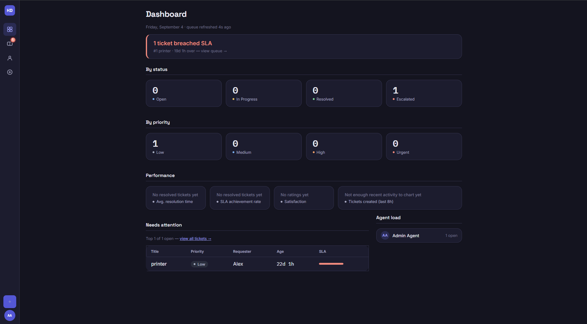

# Help Desk Ticketing App

A full-stack IT help desk ticketing system: create tickets, prioritize and assign them, track status through a workflow (Open → In Progress → Resolved, or Escalated to L2), comment on them, and see live counts on a dashboard with an SLA/time-open indicator.

Personal portfolio project — see the [Honesty note](#honesty-note) below.


> Screenshots not yet added — run the app locally (see below) and drop a few PNGs in `docs/` to replace this.

## Features

- Agent login (token-based auth)
- Create, list, filter (status/priority/category), and search tickets
- Ticket detail with full comment thread
- Change status/priority, assign to self, escalate to L2
- Dashboard with live counts by status and priority
- SLA indicator — tickets are flagged red once they exceed their priority's time-open threshold

## Tech stack

| Layer | Tech |
|---|---|
| Backend | Python, Django, Django REST Framework |
| Frontend | React (Vite) |
| Database | MySQL 8 |
| Auth | DRF token auth |
| Tests | pytest / pytest-django (backend), Vitest / React Testing Library (frontend) |

## Project structure

```
backend/    Django project + the `tickets` app (models, serializers, views, tests)
frontend/   React app (pages, components, auth context, API client)
docker-compose.yml   MySQL 8 container
```

## Setup

### 1. Start MySQL

```bash
docker compose up -d
```

### 2. Backend

```bash
cd backend
python -m venv venv
venv\Scripts\activate            # Windows; use `source venv/bin/activate` on macOS/Linux
pip install -r requirements.txt
python manage.py migrate
python manage.py createsuperuser
python manage.py runserver       # http://127.0.0.1:8000
```

Seed the four spec categories (optional, one-time):

```bash
python manage.py shell -c "from tickets.models import Category; [Category.objects.get_or_create(name=n) for n in ['Hardware','Software','Network','Account']]"
```

### 3. Frontend

```bash
cd frontend
npm install
npm run dev                      # http://localhost:5173
```

The dev server proxies `/api` to `http://127.0.0.1:8000`, so no CORS setup is needed.

Log in at `http://localhost:5173/login` with the superuser you created.

## Running tests

```bash
# Backend — runs against in-memory SQLite, no Docker/DB needed
cd backend
pip install -r requirements-dev.txt
pytest

# Frontend
cd frontend
npm run test
```

## Deployment

Deployed via the included `render.yaml` [Blueprint](https://render.com/docs/blueprint-spec) — two Render services, backend (Python) and frontend (static site).

1. Provision a MySQL database somewhere Render can reach (Render doesn't offer managed MySQL — Aiven, Railway, and Clever Cloud all have small MySQL plans). Note the host/port/db/user/password.
2. In the Render dashboard: **New → Blueprint**, point it at this repo.
3. After the first deploy, set `DB_NAME` / `DB_USER` / `DB_PASSWORD` / `DB_HOST` / `DB_PORT` on the backend service (left blank in the blueprint on purpose — Render prompts for these on blueprint creation).
4. Check the actual URLs Render assigned to both services — if they differ from `helpdesk-backend.onrender.com` / `helpdesk-frontend.onrender.com` (Render appends a suffix if the name's taken), update `DJANGO_ALLOWED_HOSTS` and `CORS_ALLOWED_ORIGINS` on the backend and `VITE_API_BASE` on the frontend to match, then redeploy.
5. Create a superuser on the deployed backend via Render's shell: `python manage.py createsuperuser`.

Locally, none of this matters — `DEBUG`, `SECRET_KEY`, and the DB connection all fall back to the same values `docker compose` already uses.

## API

| Method | Endpoint | Description |
|---|---|---|
| POST | `/api/auth/login` | Agent login, returns token + user info |
| GET | `/api/tickets` | List tickets — filters: `status`, `priority`, `category`, `assigned_to`, `search` |
| POST | `/api/tickets` | Create a ticket |
| GET | `/api/tickets/{id}` | Ticket detail, including comments |
| PATCH | `/api/tickets/{id}` | Update status / priority / assigned_to |
| POST | `/api/tickets/{id}/escalate` | Escalate to L2 |
| POST | `/api/tickets/{id}/comments` | Add a comment |
| GET | `/api/categories` | List categories |
| GET | `/api/stats` | Ticket counts by status and priority |

All endpoints except login require `Authorization: Token <token>`.

## CV line

**Help Desk Ticketing App** | Python, Django, DRF, React, MySQL — Personal Project
- Built a full-stack ticketing system with priority levels, status workflow (Open/In Progress/Resolved/Escalated), assignment and escalation to L2
- Added a dashboard with live counts and an SLA/time-open indicator per priority

## Honesty note

This project was built with AI assistance. Every part of it — models, endpoints, auth flow, and screens — was read and understood afterward, so it can be explained and defended in an interview. Labeled here, correctly, as a **Personal Project**: it demonstrates understanding of ticketing *workflows*, not professional experience with a platform like ServiceNow or Jira.
